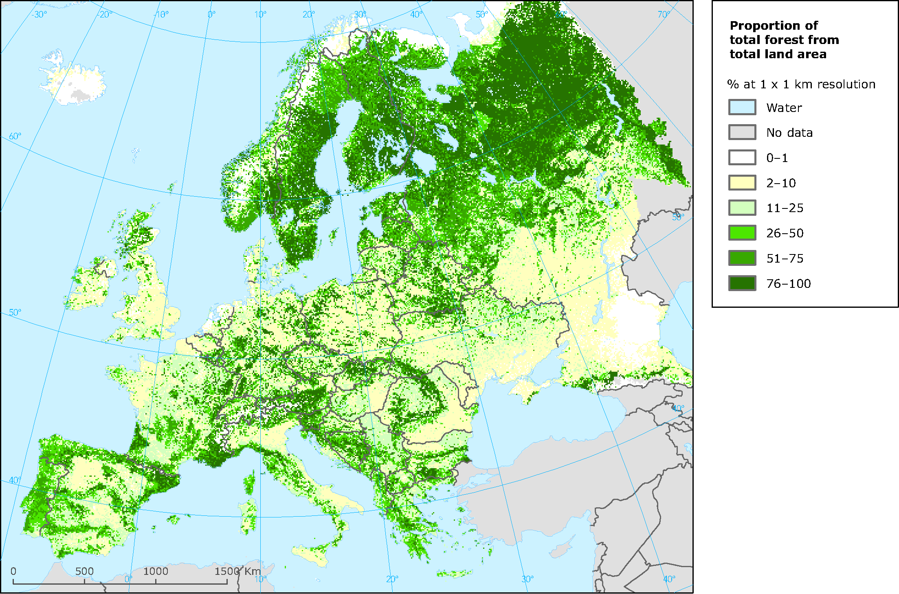
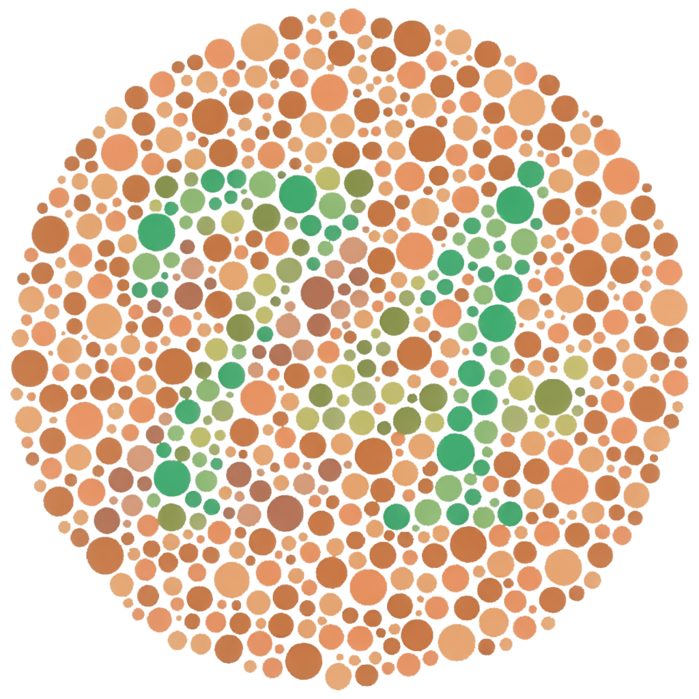
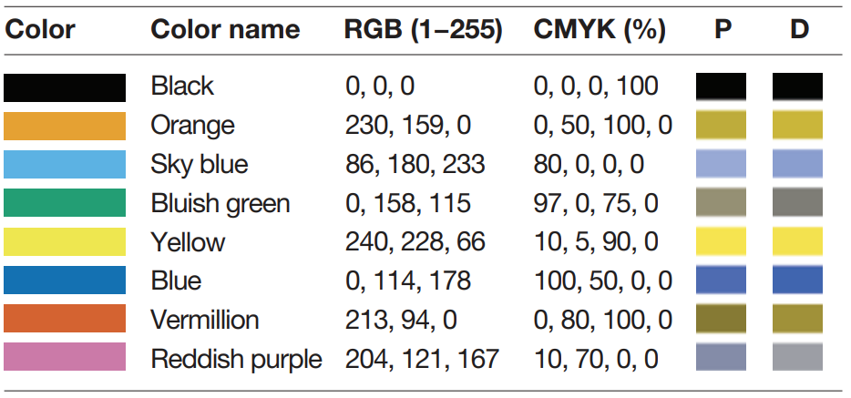
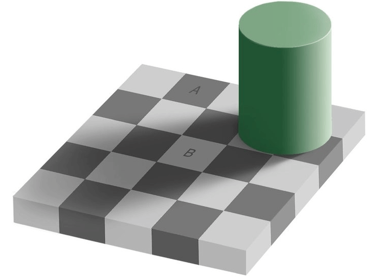

```{r setup, include = FALSE}
knitr::knit_hooks$set(crop = knitr::hook_pdfcrop)

knitr::opts_chunk$set(
  echo = TRUE,
  warning = FALSE,
  message = FALSE,
  cache = FALSE,
  dev = "png",
  fig.width = 4.8,
  fig.height = 4.1,
  fig.align = "center",
  fig.retina = 3,
  dev.args = list(pointsize = 16),
  crop = TRUE
)

library(tidyverse)
library(kableExtra)

kable <- function(x, ...) {
  knitr::kable(x, escape = FALSE, linesep = "", booktabs = TRUE)
}

library(RefManageR)
BibOptions(check.entries = FALSE,
           bib.style = "authoryear",
           style = "markdown",
           dashed = TRUE)
bib <- ReadBib("assets/references.bib")

if (!interactive()) {
  theme_set(theme_grey(base_size = 16))
}

options(digits = 3)
```

## Visualizing Categorical Data

Usually, the real aim is to visualize **proportions**.

.pull-left[
### Example

Happiness data from the US in 2006

```{r}
library(tidyverse)

data(
  "happiness",
  package = "wooldridge"
)

# see slide source code for 
# data wrangling code
```

]

```{r, echo = FALSE}
happiness <- 
  as_tibble(happiness) |>
  mutate(
    happy = factor(
      happy, 
      levels = c("not too happy", "pretty happy", "very happy" ),
      ordered = TRUE
    ),
    gender = recode( female, "1" = "female", "0" = "male" )
  ) |> filter(y06 == 1)
```

--

.pull-right[
### Bar Charts

```{r, fig.height = 3.5}
ggplot(happiness,
       aes(happy)) +
  geom_bar() #<<
```
]

---

## Grouped Bar Charts

good when counts are what matters or when you have small data sets

```{r, fig.width = 9, fig.height = 5}
ggplot(happiness, aes(gender, fill = happy)) +
  geom_bar(position = "dodge", col = "black") #<<
```

---

## Stacked Bar Charts

compact way to visualize counts, but seldom preferable over grouped bar chart

```{r, fig.width = 7, fig.height = 5}
ggplot(happiness, aes(gender, fill = happy)) +
  geom_bar(col = "black") # position = "stack" is the default #<<
```

---

## Proportional Grouped Bar Charts

good default choice for bar charts (when you have enough data)

but need to summarize data before plotting!

```{r, fig.width = 7, fig.height = 3.5}
happiness_props <- group_by(happiness, gender, happy) |>
  summarize(n = n()) |>
  mutate(prop = n / sum(n))

ggplot(happiness_props, aes(gender, prop, fill = happy)) +
  geom_col(position = "dodge", col = "black")      #<<
```

---

## Proportional Stacked Bar Charts

compact way to visualize proportions

slightly more intuitive than grouped proportional bar charts, but harder to
read
```{r, fig.width = 6}
ggplot(happiness, aes(gender, fill = happy)) +
  geom_bar(position = "fill", col = "black") + #<<
  labs(y = "proportion")
```

---

## What About Pie Charts?

okay in a few instances, but avoid as a thumb rule

.pull-left[
```{r fig.width = 4, fig.height = 6, echo = FALSE}
library(scales)

happiness_bins <-
  happiness |>
  count(workstat) |>
  mutate(work = fct_reorder(workstat, n, .desc = TRUE))

ggplot(happiness_bins, aes(x = "", y = n, fill = work)) +
  geom_col(width = 1, col = 1) +
  coord_polar("y", start = 0) +
  scale_fill_brewer(palette = "Accent") +
  theme_minimal(base_size = 16) +
  theme(
    axis.title = element_blank(),
    axis.text = element_blank(),
    panel.border = element_blank(),
    panel.grid = element_blank(),
    legend.pos = "bottom",
    legend.title = element_blank()
  ) +
  guides(fill = guide_legend(ncol = 2))
```
]

--

.pull-right[
```{r fig.height = 5, echo = FALSE}
ggplot(happiness_bins, aes(work, n, fill = work)) +
  geom_col(col = "black", show.legend = FALSE) +
  scale_fill_brewer(palette = "Accent") +
  labs(x = NULL, y = "count") +
  theme(axis.text.x = element_text(angle = 45, hjust = 1))
```
]

---

## Pay Attention to Mappings

choice of mappings is critical when dealing with categorical data!

```{r, fig.width = 7, fig.height = 4}
ggplot(happiness, aes(happy, fill = gender)) + #<<
  geom_bar(position = "fill", col = "black") +
  ylab("Proportion")
```

---

## Ordering

if variable is ordinal: just format it as an ordered factor

if variable is **not** ordinal: consider ordering it manually!

```{r, fig.width = 10, fig.height = 3.5}
# no ordering
happiness |>
  count(region) |>
  ggplot(aes(region, n)) +
  geom_col() +
  guides(x = guide_axis(n.dodge = 2)) # avoid label overlap
```

---

## Ordering

if variable is ordinal: just format it as an ordered factor

if variable is **not** ordinal: consider ordering it manually!

```{r, fig.width = 10, fig.height = 3.5}
happiness |>
  count(region) |>
  mutate(region = fct_reorder(region, n, .desc = TRUE)) |> #<<
  ggplot(aes(region, n)) +
  geom_col() +
  guides(x = guide_axis(n.dodge = 2)) # avoid label overlap
```

---

class: section-title

# Color

---

## Color in Visualizations

How do we choose colors appropriately?

You need to pay attention to data type!

--

.pull-left[
### Sequential Palette

```{r, echo = FALSE, fig.width = 5, fig.height = 0.5}
library(RColorBrewer)
par(mai = c(0, 0, 0, 0))
image(
  1:8,
  1,
  as.matrix(1:8),
  col = brewer.pal(8, "YlOrRd"),
  xlab = "",
  ylab = "",
  xaxt = "n",
  yaxt = "n",
  bty = "n"
)
```

Implies order among values

### Qualitative Palette

```{r, echo = FALSE, fig.width = 5, fig.height = 0.5}
par(mai = c(0, 0, 0, 0))
image(
  1:8,
  1,
  as.matrix(1:8),
  col = brewer.pal(8, "Accent"),
  xlab = "",
  ylab = "",
  xaxt = "n",
  yaxt = "n",
  bty = "n"
)
```

Implies no ordering
]

.pull-right[
### Diverging Palette

```{r, echo = FALSE, fig.width = 5, fig.height = 0.5}
par(mai = c(0, 0, 0, 0))
image(
  1:11,
  1,
  as.matrix(1:11),
  col = brewer.pal(11, "RdBu"),
  xlab = "",
  ylab = "",
  xaxt = "n",
  yaxt = "n",
  bty = "n"
)
```

Emphasis on low, mid, and high ends
]

---

## Natural Color Mappings

The type of data sometimes implies a natural color mapping: temperature, geographical features,
political affiliation

```{r, out.width = "70%", echo = FALSE, fig.cap = "Forest cover in Europe (www.eea.europa.eu)."}

```

---

## ggplot2

ggplot2 tries to **guess** which color palette to use

- ordinal and numerical variables are mapped to a **sequential** palette
- unordered categorical variables are mapped to a **qualitative** palette

but ggplot2 never knows when to map a variable a **diverging** palette, or which
direction of values indicate strongest intensity

--

### Applying a Color Palette in ggplot2

- `scale_color_*` for color mappings (`geom_point()`, `geom_line()` etc)
- `scale_fill_*` for fill mappings (`geom_col()`, `geom_tile()` etc etc)

---

## The colorspace Package

The names and effects of the color scale functions in ggplot2 are not
ideal. The [colorspace](https://cran.r-project.org/package=colorspace) package
has much better syntax.

`scale_<aesthetic>_<datatype>_<colorscale>()`

### Examples

- `scale_color_discrete_qualitative()`
- `scale_fill_continuous_sequential()`
- `scale_color_continuous_diverging()`
- `scale_color_discrete_divergingx()` 

The `*_divergingx()` palettes provide more flexible diverging palettes.

---

## Sequential Palettes

used for data that is ordered low to high

**examples:** population count, quality rating, size

```{r, fig.width = 9, fig.height = 3.8}
library(colorspace)
ggplot(diamonds, aes(price, fill = cut)) +
  geom_histogram(binwidth = 1000) +
  scale_fill_discrete_sequential("Viridis", rev = FALSE) #<<
```

---

## Diverging Palettes

equal emphasis on middle and low and high ends of scale

**examples:** temperature (celsius), budget balance, correlations

```{r, echo = FALSE}
mtcars_cor <- 
  cor(select(mtcars, mpg, disp, hp, drat, wt, qsec)) |>
  as.data.frame() |>
  rownames_to_column("var1") |>
  pivot_longer(mpg:qsec, names_to = "var2", values_to = "cor")
```

```{r fig.cap = "Heatmap of correlation matrix.", echo = TRUE, fig.height = 3.1}
ggplot(mtcars_cor, aes(var1, var2, fill = cor)) +
  geom_tile() +
  scale_fill_continuous_diverging("Blue-Red 2") + #<<
  labs(x = NULL, y = NULL, fill = "Correlation")
```


---

## Qualitative Palettes

colors should be as distinct as possible and not signal differences in magnitude

**examples:** political party affiliation, gender

```{r, fig.width = 8, fig.height = 4}
ggplot(msleep, aes(bodywt, sleep_total, color = vore)) +
  geom_point() +
  scale_x_log10() +
  scale_color_discrete_qualitative() #<<
```


---

## Custom Color Palettes

```{r, fig.width = 6, fig.height = 4.2}
pal <- c("dodgerblue", "brown", "firebrick1", "gold") #<<

filter(starwars, homeworld == "Tatooine") |>
  drop_na(height, mass) |>
  ggplot(aes(height, mass, color = eye_color)) +
  geom_point() +
  scale_color_manual(values = pal) #<<
```

---

## Color Blindness

.pull-left[
red-green color blindness affects 8% of men and 0.5% of females<sup>1</sup>

several different types: 

- protanotopia
- deuteranopia
- protanomaly 
- deuteranomaly
- tritanopia
- tritanomaly
]

.pull-right[
```{r, echo = FALSE, fig.cap = "Ishihara color test. What number do you see? (en.wikipedia.org/wiki/Color_blindness)"}

```

]

.footnote[
<sup>1</sup> Of people of Northern European descent.
]

---

### Simulating Color Blindness

```{r, fig.width = 10, fig.height = 5}
library(colorBlindness)

p <- ggplot(mpg, aes(hwy, fill = drv)) +
  geom_density(alpha = 0.5)
cvdPlot(p)  #<<
```

---

## ColorBrewer

based on work on color use in maps `r Citep(bib, "harrower2003")` but applicable to
most types of plots

sequential, diverging, and qualitative palettes, many tailored to individuals
with color blindness

requires [RColorBrewer](https://CRAN.R-project.org/package=RColorBrewer) package

.pull-left[
for discrete data, use `scale_color/fill_brewer()`

otherwise, the palettes are available through **colorspace**

```{r brewerplot, eval = FALSE}
p + scale_fill_brewer(
  palette = "Accent"
)
```

]

.pull-right[
```{r, ref.label = "brewerplot", echo = FALSE}
```

]

---

```{r, fig.cap = "All the palettes in ColorBrewer", fig.width = 10, fig.height = 10, echo = FALSE}
library(RColorBrewer)
display.brewer.all()
```

---

## Viridis

**sequential** palettes created by Stéfan van der Walt and Nathaniel Smith for the 
Python matplotlib library

Perceptually uniform and adapted to individuals with color blindness.

```{r viridisplot}
tibble(x = rnorm(1e4), y = rnorm(1e4)) |>
  ggplot(aes(x, y)) +
  geom_hex() + 
  scale_fill_continuous_sequential("Viridis", rev = FALSE) + #<<
  coord_fixed()
```

---

```{r, fig.show = "hold", fig.width = 8, fig.height = 1.4, echo = FALSE, crop = NULL, fig.cap = "Palettes from the viridis package"}
library(viridisLite)
par(mai = c(0, 0, 0.5, 0))
image(
  1:8,
  1,
  as.matrix(1:8),
  col = viridis(8),
  xlab = "",
  ylab = "",
  xaxt = "n",
  yaxt = "n",
  bty = "n",
  main = "viridis"
)
image(
  1:8,
  1,
  as.matrix(1:8),
  col = magma(8),
  xlab = "",
  ylab = "",
  xaxt = "n",
  yaxt = "n",
  bty = "n",
  main = "magma"
)
image(
  1:8,
  1,
  as.matrix(1:8),
  col = inferno(8),
  xlab = "",
  ylab = "",
  xaxt = "n",
  yaxt = "n",
  bty = "n",
  main = "inferno"
)
image(
  1:8,
  1,
  as.matrix(1:8),
  col = plasma(8),
  xlab = "",
  ylab = "",
  xaxt = "n",
  yaxt = "n",
  bty = "n",
  main = "plasma"
)
image(
  1:8,
  1,
  as.matrix(1:8),
  col = cividis(8),
  xlab = "",
  ylab = "",
  xaxt = "n",
  yaxt = "n",
  bty = "n",
  main = "cividis"
)
```

---

class: center, middle

### Okabe-Ito's Colorblind Friendly Palette

```{r echo = FALSE, fig.align="center"}

```
.right[`r Citep(bib, "wong2011a")`]

---

## Other Considerations

### Greyscale

Color visualizations are still sometimes printed in greyscale!

```{r, echo = FALSE, fig.width = 10, fig.height = 4, fig.cap = "The same plot in original colors and greyscale."}
library(colorBlindness)

p <- ggplot(mpg, aes(drv, fill = factor(cyl))) +
  geom_bar()
cvdPlot(p, c("origin", "desaturate"))
```

---

## Shades of Grey

```{r echo = FALSE}

```

---

## Accessibility

Remember that there are other accessibility concerns too!

---

## References

```{r, results = "asis", echo=FALSE}
PrintBibliography(bib)
```
