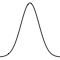
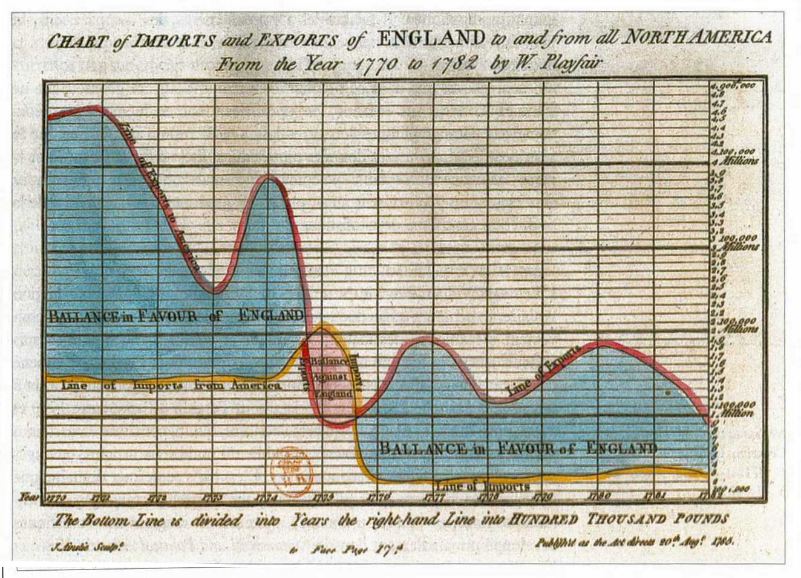

```{r setup, include = FALSE}
knitr::knit_hooks$set(crop = knitr::hook_pdfcrop)

knitr::opts_chunk$set(
  echo = TRUE,
  warning = FALSE,
  message = FALSE,
  cache = FALSE,
  dev = "png",
  fig.width = 5,
  fig.height = 4.3,
  fig.align = "center",
  fig.retina = 3,
  dev.args = list(pointsize = 16),
  crop = TRUE
)

library(tidyverse)
library(tactile)
library(lattice)
library(latticeExtra)
library(kableExtra)

kable <- function(x, ...) {
  knitr::kable(x, escape = FALSE, linesep = "", booktabs = TRUE)
}

library(RefManageR)
BibOptions(check.entries = FALSE, 
           bib.style = "authoryear",
           style = "markdown",
           dashed = TRUE)
bib <- ReadBib("assets/references.bib")

if (!interactive()) {
  theme_set(theme_grey(base_size = 16))
}

#xaringanExtra::use_search(show_icon = TRUE)

options(digits = 3)
```

## Visualizing a Single Variable

best place to start: continuous or discrete one-dimensional data

--

.pull-left[
### Example

time between eruptions of the Old Faithful geyser

always start by thinking about what the data represents
]

.pull-right[
```{r, echo = FALSE, fig.cap = "The Old Faithful Geyser (Albert Bierstadt, Public domain, via Wikimedia Commons)", out.width = "70%"}

```
]

---

## Dot Plots

good for small data sets

```{r, fig.height = 3.5, fig.width = 8.5, fig.cap = "Duration between eruptions of the Old Faithful geyser."}
library(tidyverse)

ggplot(faithful, aes(waiting)) +
  geom_dotplot(binwidth = 1) + #<<
  guides(y = "none") # default guide is incorrect
```

---

## Histograms

separates data into bins and counts the number of observations

choice of bin widths is critical

.pull-left[
```{r, fig.cap = "Too narrow bin width. (This is actually equivalent to a bar plot.)", fig.height = 3}
faithful %>%
  ggplot(aes(waiting)) +
  geom_histogram(binwidth = 1) #<<
```
]

.pull-right[
```{r, fig.cap = "Reasonable bin width", fig.height = 3}
faithful %>%
  ggplot(aes(waiting)) +
  geom_histogram(binwidth = 3) #<<
```
]

---

## Box Plots

.pull-left[
most common type:

  - middle bar: **median** (2nd quartile)
  - edges of box: 1st and 3rd **quartiles**
  - whiskers: last observation within 1.5 times the
    inter-quartile range (IQR)
  - points: observations outside 1.5 times the IQR

compact

but not suitable for data with multiple modes
]

.pull-right[
```{r, fig.height = 2.5, fig.cap = "Box plot of the Old Faithful data, which fails completely in accurately describing the distribution."}
faithful %>%
  ggplot(aes(waiting)) +
    geom_boxplot() #<<
```
]

---

## Density Plots

great when you have lots of data and the variable is continuous

but sensitive to settings (type of kernel, bandwidth)

.pull-left[
```{r, fig.height = 3}
faithful %>%
  ggplot(aes(waiting)) +
    geom_density(bw = 5) #<<
```
]

.pull-right[
```{r, fig.height = 3}
faithful %>%
  ggplot(aes(waiting)) +
    geom_density(bw = 10) #<<
```
]

often good idea to add a **rug** layer (`geom_rug()`) to density plots

```{r, echo = FALSE}
x <- c(-1, 3, 5, 6, 9)
n <- length(x)

l <- lapply(x, function(xi) {
  a <- seq(-4, 4, length.out = 100)
  d <- dnorm(a) / n
  data.frame(
    x = xi,
    a = a + xi,
    d = d
  )
})

res <- do.call(rbind, l)

p1 <- ggplot() +
  xlim(c(-5, 15)) +
  ylim(c(0, 0.15)) +
  labs(x = NULL, y = "Density")

p2 <- p1 +
  geom_rug(aes(x), data = tibble(x = x), cex = 1, col = "navy")

p3 <- p2 + 
  geom_line(aes(a, d, group = x), col = "dark orange", data = res)

p4 <- p3 +
  geom_density(aes(x), bw = 1, data = tibble(x = x))
```

---

### How Does a Density Plot Work?

We start with an empty canvas.

```{r, echo = FALSE, fig.width = 7}
p1
```

---

### How Does a Density Plot Work?

Then we mark the points with a rug layer (`geom_rug()`).

```{r, echo = FALSE, fig.width = 7}
p2
```

---

### How Does a Density Plot Work?

Next, we add a Gaussian (Normal) density kernel for each point.

```{r, echo = FALSE, fig.width = 7}
p3
```

---

### How Does a Density Plot Work?

Finally, we sum the kernels together.

```{r, echo = FALSE, fig.width = 7}
p4
```

The black line is our final density estimate.

---

## Violin Plots

a type of density plot, often as an alternative to box plots when you have
lots of (continuous) data

```{r, fig.height = 3, fig.width = 6.5, fig.cap = "geom_violin() does not work with a single variable, so we use the trick y = 1 here."}
faithful %>%
  ggplot(aes(waiting, y = 1)) +
    geom_violin() #<<
```

---

## Combining Layers

with ggplot, it's easy to combine layers

```{r, fig.height = 3, fig.width = 6.5, fig.cap = "A combined box and violin plot"}
faithful %>%
  ggplot(aes(waiting, y = 1)) +
    geom_violin() +
    geom_boxplot(width = 0.1, fill = "slategray2")
```

---

## Recap

 Few observations? Try a **dot plot**.

  Lots of data on a 
continuous variable? **Density** and **violin** plots are great!

 The data is uni-modal and you only care about
quartiles (e.g. the median) and extreme values? The **box plot** will fit the
bill nicely.

 In most other cases, a **histogram** is usually
your best best.

---

class: section-title

# Principles for Data Visualization

## Data Ink

---

## Data-Ink

Make good use for your ink!

Data-ink `r Citep(bib, "tufte2001")`: the ink used to draw data.

$$
\begin{aligned}
\text{data-ink ratio} 
&= \frac{\text{data-ink}}{\text{total ink used in visualization}}\\ 
&= 1 - \text{proportion of a graphic that can be erased}
\end{aligned}
$$

--

### Tufte's Principles

.pull-left[
* Above all else show the data.
* Maximize the data-ink ratio.
* Erase non-data ink.
* Erase redundant data-ink.
* Revise and edit.
]

.pull-right[
```{r, out.width = "80%", echo = FALSE}
knitr::include_graphics("images/tufte.png")
```

]

---

## Above All Else Show the Data

```{r, echo = FALSE, fig.cap = "William Playfair, The Commercial and Political Atlas (1786). Public domain.", out.width = "80%"}

```

---

## Above All Else Show the Data

```{r, echo = FALSE, fig.cap = "William Playfair, The Commercial and Political Atlas (1786). Public domain.", out.width = "80%"}
knitr::include_graphics("images/playfair-nordic-england.jpg")
```

---

## Maximize the Data-Ink Ratio

Non-data-ink may distract your audience from what really matters: the data.

Maximizing the data-ink (within reason) is a good rule-of-thumb.

.pull-left[
```{r, echo = FALSE, fig.cap = "low data-ink ratio", fig.height = 4.5}
mpg2 <- mutate(mpg, cyl = factor(cyl))
ticks <- pretty(1:80)

ggplot(mpg2, aes(cyl)) +
  geom_bar()
```
]

--

.pull-right[
```{r, echo = FALSE, fig.cap = "high data-ink ratio", fig.height = 4.5}
ggplot(mpg2, aes(cyl)) +
  theme_minimal(base_size = 14) +
  theme(panel.grid = element_blank()) +
  geom_bar(width = 0.5) +
  geom_hline(yintercept = ticks, col = "white", lwd = 1)
```
]

---

## Redundant Data-Ink

**redundant** data-ink: ink displaying information already shown by other ink

.pull-left[
```{r, fig.cap = "lots of redundant ink", echo = FALSE, fig.height = 4.5}
ggplot(mpg2, aes(cyl, fill = cyl)) +
  geom_bar() +
  geom_text(aes(label = after_stat(count)), 
            stat = "count", 
            vjust = -1) +
  ylim(0, 90)
```
]

--

.pull-right[
```{r, fig.cap = "no redundancy", echo = FALSE, fig.height = 4.5}
ggplot(mpg2, aes(cyl)) +
  geom_point(stat = "count") +
  lims(y = c(0, 83))
```
]

**note:** redundancy is not always bad

---

## ggthemes

**ggthemes** `r Citep(bib, "arnold2019")` provides a theme and some custom
plots for ggplot2

.pull-left[
```{r, fig.height = 3.5}
library(ggthemes)
ggplot(mpg, aes(drv, cty)) +
  geom_tufteboxplot() + #<<
  theme_tufte(base_size = 16) #<<
```
]

.pull-right[
```{r, fig.height = 4.3}
ggplot(mpg, aes(drv, cty)) +
  geom_boxplot(
    stat = "fivenumber"
  )
```
]

---

## References

```{r, results = "asis", echo = FALSE}
PrintBibliography(bib)
```
